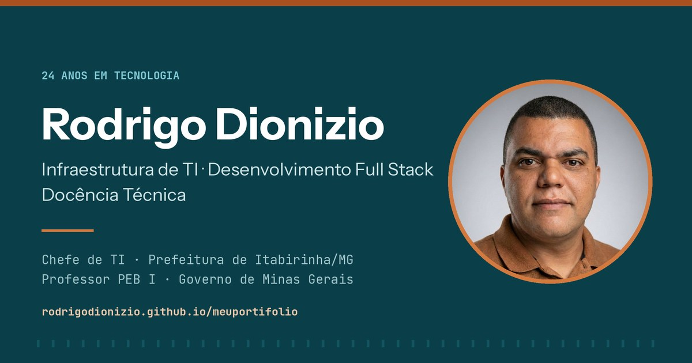

# Portfólio — Rodrigo Dionizio

[](https://rodrigodionizio.github.io/meuportifolio/)
[](./LICENSE)
[](#stack)

Portfólio profissional de **Rodrigo Dionizio** — infraestrutura de TI, desenvolvimento full stack e docência técnica.

**Acesse:** <https://rodrigodionizio.github.io/meuportifolio/> · **English:** <https://rodrigodionizio.github.io/meuportifolio/en/>



---

## O que o site apresenta

| Seção | Conteúdo |
| --- | --- |
| Especialidades | Duas frentes principais (infraestrutura e desenvolvimento) e a competência de sustentação (docência e gestão) |
| Projetos em produção | Sacristia Digital, OSCRM, Calendário Litúrgico Paroquial e Sorteios Bom Jesus |
| Infraestrutura | Estudos de caso com desafio, solução e resultado, e a topologia implantada |
| Stack | Tecnologias agrupadas por profundidade real de uso, sem porcentagens |
| Experiência | Trajetória de 2002 até hoje, com resultados quantificados |
| Contato | Canais diretos e formulário |

## Stack

Sem framework, sem build, sem dependências em tempo de execução — o site é servido como está.

- **HTML5** semântico, com dados estruturados `schema.org` (`Person`, `ProfilePage`, `ItemList`)
- **CSS3** com custom properties, tema claro e escuro, e layout em grid/flex
- **JavaScript** ES5 sem bibliotecas, em módulo IIFE
- **GitHub Pages** servindo a pasta `/docs`

### Decisões técnicas

- **Nenhum framework.** O site é conteúdo estático; um bundler só adicionaria peso e manutenção.
- **Imagens em WebP com fallback JPEG**, dimensões declaradas e `loading="lazy"` — a primeira tela pesa menos de 400 KB.
- **Ícones em SVG inline** (sprite `<symbol>` + `<use>`), sem emojis: leitores de tela anunciam o rótulo correto.
- **Tema escuro por token**, respeitando `prefers-color-scheme` e permitindo escolha explícita persistida.
- **O formulário nunca simula sucesso.** Sem chave de envio configurada, ele entrega a mensagem por e-mail ou WhatsApp já preenchidos.

## Estrutura

```
.
├── docs/                          # raiz publicada no GitHub Pages
│   ├── index.html                 # versão pt-BR
│   ├── en/index.html              # versão em inglês
│   ├── robots.txt
│   ├── sitemap.xml
│   ├── site.webmanifest
│   └── assets/
│       ├── css/style.css
│       ├── js/main.js
│       ├── img/                   # imagens otimizadas (WebP + JPEG)
│       ├── icons/                 # favicon e ícones de aplicativo
│       ├── og/                    # imagem de compartilhamento 1200×630
│       └── cv/                    # currículo em PDF
├── .github/workflows/qualidade.yml
├── MANUTENCAO.md                  # como atualizar o conteúdo
├── LICENSE
└── README.md
```

## Rodar localmente

```bash
git clone https://github.com/rodrigodionizio/meuportifolio.git
cd meuportifolio
python3 -m http.server 8000 --directory docs
# abra http://localhost:8000
```

Não use `file://`: o `srcset` e o `manifest` exigem um servidor HTTP.

## Manutenção

Como trocar fotos, atualizar projetos, publicar o currículo e ativar o envio do formulário está em **[MANUTENCAO.md](./MANUTENCAO.md)**.

## Qualidade

O workflow `.github/workflows/qualidade.yml` roda a cada push e verifica HTML válido, links quebrados e o orçamento de performance no Lighthouse.

## Licença

[MIT](./LICENSE) — o código é livre. O conteúdo textual, as imagens e a identidade pessoal não são.

---

**Contato:** [rodrigo.dionizio@gmail.com](mailto:rodrigo.dionizio@gmail.com) · [LinkedIn](https://www.linkedin.com/in/rodrigodionizio) · [WhatsApp](https://wa.me/5533988203127)
