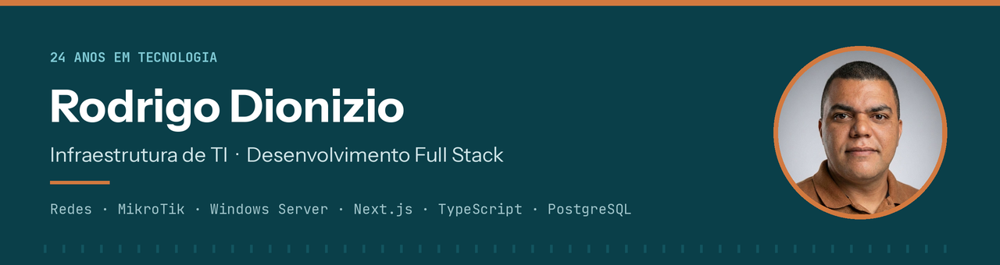
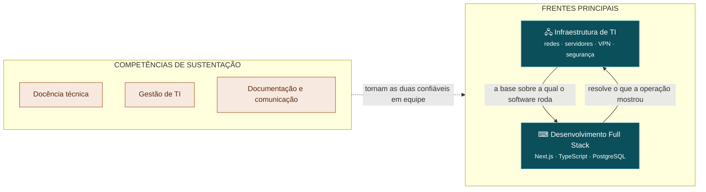

### Infraestrutura que não cai. Software que entra em produção.

**23 anos** projetando redes, servidores e VPNs — e construindo as aplicações que rodam sobre elas. 
Chefe de Departamento de TI desde 2003 · Professor técnico de Informática · Minas Gerais, Brasil

[%2098820--3127-1F6B4B?style=for-the-badge&logo=whatsapp&logoColor=white)](https://wa.me/5533988203127)

---

## Em produção agora

Quatro sistemas meus estão no ar neste momento, com usuários reais — construídos, publicados e mantidos por mim, do banco de dados ao suporte.

| Sistema | O que é | Stack | Estado |
| :--- | :--- | :--- | :--- |
| **[Sacristia Digital](https://sacristiadigital.com.br)** | Plataforma SaaS **multi-tenant** de gestão paroquial: agenda litúrgica, eventos, comunidade e relatórios. Cada paróquia em ambiente isolado, com autenticação e níveis de permissão próprios. | `Next.js` `TypeScript` `React` `PostgreSQL` `Tailwind` | 🟢 Produção · domínio próprio |
| **OSCRM** | HelpDesk e CRM interno de ordens de serviço de TI: abertura de chamado, triagem por prioridade, **fila com SLA**, atribuição a técnicos, histórico e relatórios. | `Next.js` `TypeScript` `PostgreSQL` `Vercel` | 🟢 Produção · uso interno diário · acesso restrito |
| **[Calendário Litúrgico Paroquial](https://rodrigodionizio.github.io/calendario-liturgico-paroquial/)** | Gestão pastoral completa em **PWA offline**: calendário litúrgico, escalas de equipes, mural de avisos, painel administrativo e relatórios em PDF. Captura diária da liturgia por **Edge Function em Deno**; cache derruba 70% das chamadas de API. | `JavaScript ES6+` `Supabase` `PostgreSQL` `Deno` `Python` `PWA` | 🟢 Produção · [código público](https://github.com/rodrigodionizio/calendario-liturgico-paroquial) |
| **[Sorteios Bom Jesus](https://sorteios-bomjesus.vercel.app)** | Campanhas, rifas e ações entre amigos: reserva de números **em tempo real**, comprovante ao participante, painel de vendas e prestação de contas pública. | `Next.js` `TypeScript` `Vercel` | 🟢 Produção · campanhas reais |

Também no ar: **[Avisos EENSA](https://avisos-eensa.vercel.app)** (quadro de avisos digital de escola estadual) e **[PoupeMais](https://rodrigodionizio.github.io/PoupeMais/)** (metas de poupança).

---

## Como as duas frentes se sustentam

Projeto o sistema sabendo quem vai manter o servidor, porque o servidor também é meu. É isso que as duas frentes juntas entregam.

---

## Infraestrutura de TI

<b>23 anos de infraestrutura que não pode parar</b> · clique para recolher

 

Responsável pela infraestrutura de tecnologia de um município inteiro desde 2003: rede, servidores, bancos de dados, segurança e suporte a todas as secretarias. Em paralelo, projetos de rede corporativa para indústria e laboratórios clínicos.

**Domínio — em produção sob minha responsabilidade**

**Sólido — uso com autonomia**

-3E7D88?style=flat-square&logo=linux&logoColor=white)

**Entregas representativas**

| Projeto | Escopo | Resultado |
| :--- | :--- | :--- |
| **Datacenter Laticínios Vila Nova** | Rack 24U, cabeamento certificado Furukawa, servidor de arquivos, CFTV e telefonia IP | Infraestrutura documentada e manutenível, 4 meses de execução |
| **BIONALISE** | Firewall MikroTik, switch core, 3 VLANs e Wi-Fi corporativo | Tráfego de visitantes isolado da rede clínica, 3 meses |
| **ITALAB** | VPN site-to-site entre unidades de laboratório | Operação contínua sem expor sistemas à internet pública |
| **Prefeitura de Itabirinha** | Modernização completa da TI municipal | **−60% de custo operacional** |

---

## Desenvolvimento Full Stack

<b>Aplicações que resolvem um problema real e chegam à produção</b> · clique para recolher

 

Construo software para operações que eu conheço por dentro — gestão pública, laboratório clínico, paróquia, escola. O resultado é sempre um sistema que alguém usa todo dia, não um repositório de exercício.

**Domínio — em produção sob minha responsabilidade**

**Sólido — uso com autonomia**

**Em evolução — aprofundamento ativo**

**O que sei construir**

- Arquitetura **SaaS multi-tenant** com isolamento por cliente, autenticação e níveis de permissão
- Modelagem relacional e consultas complexas — vindo de anos de SQL Server em ERP
- Painéis administrativos e relatórios que a gestão realmente usa
- Deploy contínuo e operação pós-lançamento, incluindo o suporte

---

## Competências

<b>Docência, gestão e comunicação</b> — o que torna as duas frentes confiáveis em equipe · clique para abrir

 

Não são uma terceira carreira. São as competências que fazem o meu trabalho técnico sobreviver à minha ausência: documentação que outra pessoa entende, decisão explicada para quem aprova o orçamento, equipe capacitada para operar o que foi entregue.

| Competência | Onde se prova |
| :--- | :--- |
| **Docência técnica** | Professor de curso técnico em Informática — Governo de MG (2013–2015 e 2023–2025). Lógica de Programação, Planilhas e Informática para Internet. **100+ alunos formados** |
| **Gestão de TI** | Chefia de departamento desde 2003: equipe, orçamento, fornecedores e contratos |
| **Capacitação de equipes** | **200+ servidores públicos** treinados em sistemas corporativos |
| **Documentação técnica** | Topologias, procedimentos e transferência de conhecimento em todo projeto entregue |
| **Interlocução técnica–gestão** | Traduzir decisão de arquitetura em termos de custo, risco e prazo |

Quem ensina precisa simplificar sem perder o rigor. Isso aparece no código, no diagrama de rede e na reunião com o gestor.

---

## Trajetória

<b>2003 → hoje</b> · clique para abrir

 

| Período | Cargo | Organização |
| :--- | :--- | :--- |
| **2003 — atual** | Chefe do Departamento de TI | Prefeitura Municipal de Itabirinha |
| 2023 — 2025 | Professor de curso técnico em Informática | Governo do Estado de Minas Gerais |
| 2003 — 2024 | Consultor de infraestrutura de TI | SERTEC, Laticínios Vila Nova, BIONALISE, ITALAB |
| 2018 — 2020 | Supervisor de Informática | Prefeitura Municipal de São José do Divino |
| 2013 — 2015 | Professor de curso técnico em Informática | Governo do Estado de Minas Gerais |
| 2008 | Analista de Suporte | TOTVS S.A. — Unidade Leste de Minas |

**Formação:** Bacharelado em Sistemas de Informação — UNIVALE (2008) · Técnico em Informática com ênfase em Internet — ETEIT (2001) · Pós-graduação em Engenharia de Redes, em andamento.
**Certificação:** Cabeamento Estruturado — Furukawa (FCA), 120 horas.
**Idiomas:** português nativo · inglês técnico (leitura fluente de documentação) · espanhol.

---

## Contato

Estou **aberto a novas oportunidades** em infraestrutura de TI, desenvolvimento full stack ou posições que combinem as duas — remoto, híbrido ou presencial. Respondo em até um dia útil.

| | |
| :--- | :--- |
| **Portfólio** | <https://rodrigodionizio.github.io/meuportifolio/> ([English](https://rodrigodionizio.github.io/meuportifolio/en/)) |
| **LinkedIn** | [in/rodrigodionizio](https://www.linkedin.com/in/rodrigodionizio) |
| **E-mail** | [rodrigo.dionizio@gmail.com](mailto:rodrigo.dionizio@gmail.com) |
| **WhatsApp** | [(33) 98820-3127](https://wa.me/5533988203127) |
| **Localização** | Itabirinha, Minas Gerais — Brasil (UTC−3) |

A maior parte do meu trabalho está em repositórios privados de clientes e da administração pública. Os sistemas em produção listados acima são a evidência pública — todos podem ser abertos e usados agora.

